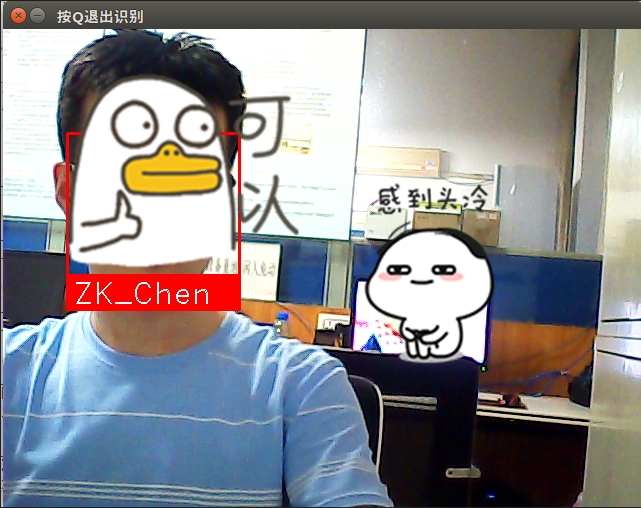

利用开源库，实时监测人脸


## face_recognition[人脸识别库](https://github.com/ageitgey/face_recognition)
这是世界上最简单的人脸识别库了。你可以通过Python引用或者命令行的形式使用它，来管理和识别人脸。
该软件包使用dlib中最先进的人脸识别深度学习算法，使得识别准确率在《Labled Faces in the world》测试基准下达到了99.38%。
它同时提供了一个叫face_recognition的命令行工具，以便你可以用命令行对一个文件夹中的图片进行识别操作。
face_recognition库具有以下功能：
* 在图片中识别人脸
* 找到病操作识别出的脸部特征(美图秀秀之类软件功能)
* 识别图片中的人
* 摄像头实时人脸识别
* 更多功能可以关注项目[Github](https://github.com/ageitgey/face_recognition)

> 本来想直接在windows下跑一下这个库的examples，
无奈windows环境下遇到的问题太多了，记录不过来（暂且记录以下。。）
后面阶段直接投奔ubuntu了，并成功找实验室小伙伴测试


## 关于OpenCV
OpenCV是一个基于BSD许可（开源）发行的跨平台计算机视觉库，可以运行在Linux、Windows、Android和Mac OS操作系统上。
它轻量级而且高效——由一系列 C 函数和少量 C++ 类构成，同时提供了Python、Ruby、MATLAB等语言的接口，实现了图像处理
和计算机视觉方面的很多通用算法。 OpenCV用C++语言编写，它的主要接口也是C++语言，但是依然保留了大量的C语言接口。 
在计算机视觉项目的开发中，OpenCV作为较大众的开源库，拥有了丰富的常用图像处理函数库，采用C/C++语言编写，可以运行在
Linux/Windows/Mac等操作系统上，能够快速的实现一些图像处理和识别的任务。此外，OpenCV还提供了Java、python、cuda等的
使用接口、机器学习的基础算法调用，从而使得图像处理和图像分析变得更加易于上手，让开发人员更多的精力花在算法的设计上。


### OpenCV应用领域

1、人机互动 2、物体识别 3、图像分割 4、人脸识别 5、动作识别 6、运动跟踪 7、机器人 8、运动分析 9、机器视觉 10、结构分析 11、汽车安全驾驶

图像数据的操作 ( 分配、释放、复制、设置和转换)。 图像是视频的输入输出I/O （文件与摄像头的输入、图像和视频文件输出）。
 矩阵和向量的操作以及线性代数的算法程序（矩阵积、解方程、特征值以及奇异值等）。
各种动态数据结构（列表、队列、集合、树、图等）。 
基本的数字图像处理（滤波、边缘检测、角点检测、采样与差值、色彩转换、形态操作、直方图、图像金字塔等）。 
结构分析（连接部件、轮廓处理、距离变换、各自距计算、模板匹配、Hough变换、多边形逼近、直线拟合、椭圆拟合、Delaunay 三角划分等）。 
摄像头定标（发现与跟踪定标模式、定标、基本矩阵估计、齐次矩阵估计、立体对应）。
运动分析（光流、运动分割、跟踪）。 
目标识别（特征法、隐马尔可夫模型：HMM）。
基本的GUI （图像与视频显示、键盘和鼠标事件处理、滚动条）。 

图像标注（线、二次曲线、多边形、画文字）

### 安装OpenCV
先去官网https://www.lfd.uci.edu/~gohlke/pythonlibs/#opencv，下载相应Python版本的OpenCV的whl文件，
如本人下载的opencv_python‑3.4.1-cp36-cp36m-win_amd64.whl(实测37版不行)

然后把whl文件放到anaconda/lib/site-packages目录下
执行 pip install opencv_python‑3.4.1-cp36-cp36m-win_amd64.whl

import cv2确认是否安装完毕


## 安装face_recognition
https://pypi.org/project/face_recognition/#files
直接用pip install face_recognition报错，因为face_recognition依赖的dlib库没有安装

### 1、安装dlib
所以需要先安装dlib，有三种方法：
T1方法：pip install dlib
此方法是需要在你安装cmake、Boost环境的计算机使用

T2方法：conda install -c menpo dlib=18.18
此方法适合那些已经安装好conda库的环境的计算机使用，conda库的安装本博客有详细攻略，请自行翻看。

T3方法：pip install dlib-19.8.1-cp36-cp36m-win_amd64.whl[链接]()

按照方法二安装dlib，结果它把我的Anaconda版本降级了，python也从3.6.4降到了3.5。。。。。
在此pip install dlib还是报错，提示没有Cmake

### 2、安装cmake
[下载链接](https://cmake.org/download/) 需要添加环境变量

### 3、安装msgpack
继续报错，提示没有msgpack
那就继续pip

### 4、需要更新VStudio到2015。。。
太大了
### 5、投奔ubuntu


## Dlib介绍

Dlib是一个包含机器学习算法的C++开源工具包。Dlib可以帮助您创建很多复杂的机器学习方面的软件来帮助解决实际问题。目前Dlib已经被广泛的用在行业和学术领域,包括机器人,嵌入式设备,移动电话和大型高性能计算环境。
Dlib是开源的、免费的;[官网](http://dlib.net/)和[github地址](https://github.com/davisking/dlib)

### Dlib的主要特点:
> 文档齐全
不像很多其他的开源库一样,Dlib为每一个类和函数提供了完整的文档说明。同时,还提供了debug模式;打开debug模式后,用户可以调试代码,查看变量和对象的值,快速定位错误点。另外,Dlib还提供了大量的实例。
> 高质量的可移植代码
Dlib不依赖第三方库,无须安装和配置,这部分可参照(官网左侧树形目录的how to compile的介绍)。Dlib可用在window、Mac OS、Linux系统上。
> 提供大量的机器学习 / 图像处理算法
* 深度学习
* 基于SVM的分类和递归算法
* 针对大规模分类和递归的降维方法
* 相关向量机(relevance vector machine);是与支持向量机相同的函数形式稀疏概率模型,对未知函数进行预测或分类。其训练是在贝叶斯框架下进行的,与SVM相比,不需要估计正则化参数,其核函数也不需要满足Mercer条件,需要更少的相关向量,训练时间长,测试时间短。
* 聚类: linear or kernel k-means, Chinese Whispers, and Newman clustering. Radial Basis Function Networks
* 多层感知机

详细内容可参加官网介绍

## ubuntu下环境配置
### 安装git、cmake、python-pip3

``` python
# 安装 git 
$ sudo apt-get install -y git 
# 安装 cmake 
$ sudo apt-get install -y cmake 
# 安装 python-pip 
$ sudo apt-get install -y python-pip3  
```
 
### 安装编译dlib
``` python
# 编译dlib前先安装 boost 
$ sudo apt-get install libboost-all-dev 
 
# 开始编译dlib 
# 克隆dlib源代码 
$ git clone https://github.com/davisking/dlib.git 
$ cd dlib 
$ mkdir build 
$ cd build 
$ cmake .. -DDLIB_USE_CUDA=0 -DUSE_AVX_INSTRUCTIONS=1 
$ cmake --build .（注意中间有个空格） 
$ cd .. 
$ sudo python setup.py install --yes USE_AVX_INSTRUCTIONS --no DLIB_USE_CUDA  
```

### 安装face_recognition
``` python
# 安装 face_recognition 
$ sudo pip install face_recognition 
# 安装face_recognition过程中会自动安装 numpy、scipy 等  
``` 
### 验证
安装完毕后
import face_recognition测试一下

## 测试源码
``` python
import face_recognition
import cv2

# This is a demo of running face recognition on live video from your webcam. It's a little more complicated than the
# other example, but it includes some basic performance tweaks to make things run a lot faster:
#   1. Process each video frame at 1/4 resolution (though still display it at full resolution)
#   2. Only detect faces in every other frame of video.

# PLEASE NOTE: This example requires OpenCV (the `cv2` library) to be installed only to read from your webcam.
# OpenCV is *not* required to use the face_recognition library. It's only required if you want to run this
# specific demo. If you have trouble installing it, try any of the other demos that don't require it instead.

# Get a reference to webcam #0 (the default one)
video_capture = cv2.VideoCapture(0)

# Load a sample picture and learn how to recognize it.
obama_image = face_recognition.load_image_file("czk.jpg")
obama_face_encoding = face_recognition.face_encodings(obama_image)[0]

# Load a second sample picture and learn how to recognize it.
biden_image = face_recognition.load_image_file("xuanjie.png")
biden_face_encoding = face_recognition.face_encodings(biden_image)[0]

# Create arrays of known face encodings and their names
known_face_encodings = [
    obama_face_encoding,
    biden_face_encoding
]
known_face_names = [
    "ZK_Chen",
    "xuanjie"
]

# Initialize some variables
face_locations = []
face_encodings = []
face_names = []
process_this_frame = True

while True:
    # Grab a single frame of video
    ret, frame = video_capture.read()

    # Resize frame of video to 1/4 size for faster face recognition processing
    small_frame = cv2.resize(frame, (0, 0), fx=0.25, fy=0.25)
    # Convert the image from BGR color (which OpenCV uses) to RGB color (which face_recognition uses)
    rgb_small_frame = small_frame[:, :, ::-1]

    # Only process every other frame of video to save time
    if process_this_frame:
        # Find all the faces and face encodings in the current frame of video
        face_locations = face_recognition.face_locations(rgb_small_frame)
        face_encodings = face_recognition.face_encodings(rgb_small_frame, face_locations)

        face_names = []
        for face_encoding in face_encodings:
            # See if the face is a match for the known face(s)
            matches = face_recognition.compare_faces(known_face_encodings, face_encoding)
            name = "Unknown"

            # If a match was found in known_face_encodings, just use the first one.
            if True in matches:
                first_match_index = matches.index(True)
                name = known_face_names[first_match_index]

            face_names.append(name)

    process_this_frame = not process_this_frame


    # Display the results
    for (top, right, bottom, left), name in zip(face_locations, face_names):
        # Scale back up face locations since the frame we detected in was scaled to 1/4 size
        top *= 4
        right *= 4
        bottom *= 4
        left *= 4

        # Draw a box around the face
        cv2.rectangle(frame, (left, top), (right, bottom), (0, 0, 255), 2)

        # Draw a label with a name below the face
        cv2.rectangle(frame, (left, bottom - 35), (right, bottom), (0, 0, 255), cv2.FILLED)
        font = cv2.FONT_HERSHEY_DUPLEX
        cv2.putText(frame, name, (left + 6, bottom - 6), font, 1.0, (255, 255, 255), 1)

    # Display the resulting image
    cv2.imshow('按Q退出识别', frame)     #视频捕捉窗口左上角的名称

    # Hit 'q' on the keyboard to quit!
    if cv2.waitKey(1) & 0xFF == ord('q'):    #设置退出按键
        break

# Release handle to the webcam
video_capture.release()
cv2.destroyAllWindows()
```

### 效果
给自己打个码，给后面的师弟也打个码==

这个库也可以做人脸特征修改，大概市面上应用的一些软件原理也是类似吧
 
### 问题记录
环境配置的问题就不提了

> 摄像头黑屏问题：

[解决方案：](https://blog.csdn.net/flyingcys/article/details/57406701)

> 中文输入问题

[解决方案：](https://jingyan.baidu.com/article/9c69d48ffe632613c9024ef5.html)

> 下载过慢(下载源问题)

[解决方案：](https://blog.csdn.net/zhuanshu666/article/details/73413503)