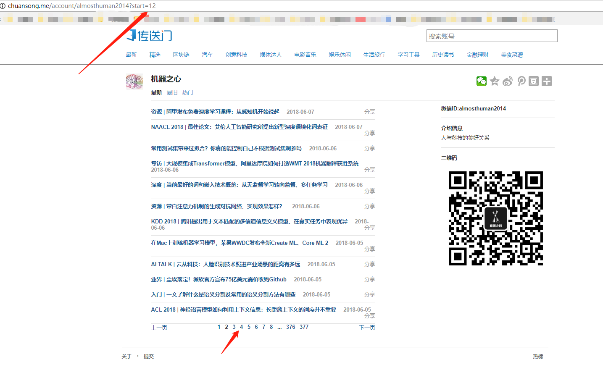
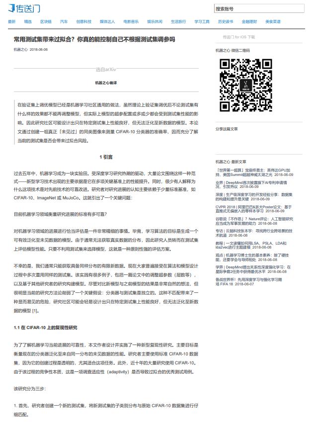
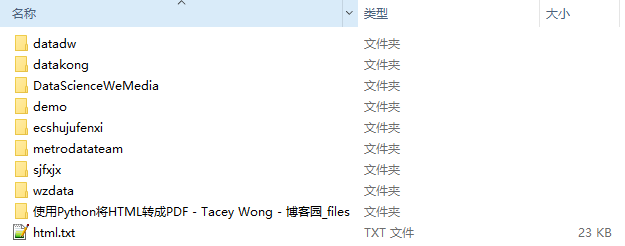
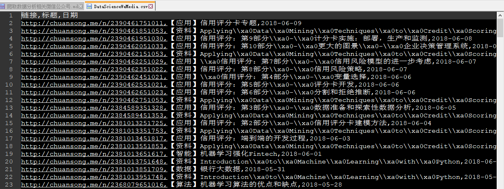
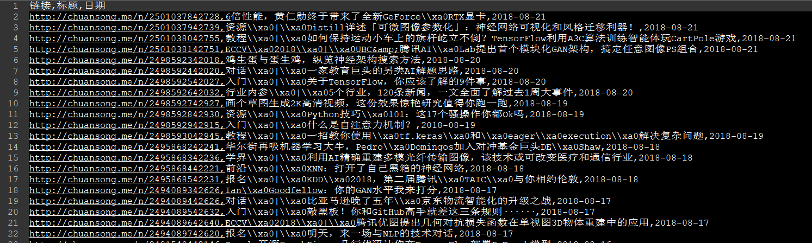

## 1需求分析
平时爱逛知乎，收藏了不少别人推荐的数据分析、机器学习相关的微信公众号（这里就不列举了，以免硬广嫌疑）。但是在手机微信上一页页的翻阅历史文章浏览，很不方便，电脑端微信也不方便。

所以我就想有什么方法能否将这些公众号文章下载下来。这样的话，看起来也方便。但是网上的方法要么太复杂（对于我这个爬虫入门新手来说），要么付费。

但我的需求其实却很简单——“**方便的查找 / 检索 / 浏览相关公众号的任意文章**”，所以，一番学习检索后，上手做了一个小工具（打包成可执行文件了），虽然方法和代码相当简单，但实际上手用起来还是挺方便的。也给身边伙伴安利了几波。

**工具需求：**
* 输入：给定公众号ID，和用户需要获取的公众号文章目录页码数（小于已发布最大收录页数）
* 输出Ⅰ：每个公众号历史文章信息csv文件（链接+标题）
* 输出Ⅱ: wkhtmltopdf和pdfkit将html转换成PDF文件或者图片文件（初稿）


## 2现有方案

之前在网上也搜索了些爬取微信公众号的资料，大概有如下几种

### selenium爬取流程
* 1.安装python selenium自动模块，通过selenium中的webdriver驱动浏览器获取Cookie登录微信公众号后台； 
* 2.使用webdriver功能需要安装对应浏览器的驱动插件
注意：谷歌浏览器版本和chromedriver需要对应，否则会导致启动时报错。
* 3.微信公众号登陆地址：https://mp.weixin.qq.com/ 
* 4.微信公众号文章接口地址可以在微信公众号后台中新建图文消息，超链接功能中获取：
* 5.搜索公众号名称 
* 6.获取要爬取的公众号的fakeid 
* 7.选定要爬取的公众号，获取文章接口地址 
* 8.文章列表翻页及内容获取 

### AnyProxy代理批量采集
* 1、一个微信客户端：可以是一台手机安装了微信的app，或者是用电脑中的安卓模拟器。
* 2、一个微信个人号：为了采集内容不仅需要微信客户端，还要有一个微信个人号专门用于采集。
* 3、本地代理服务器系统：通过Anyproxy代理服务器将公众号历史消息页面中的文章列表发送到自己的服务器上。
* 4、文章列表分析与入库系统，分析文章列表和建立采集队列实现批量采集内容。

### Fiddler设置代理和抓包
通过对多个账号进行抓包分析，可以确定:
* _biz:这个14位的字符串是每个公众号的“id”，搜狗的微信平台可以获得
* uin:与访问者有关，微信号id
* key:和所访问的公众号有关
**步骤：**
* 1，写按键精灵脚本，在手机上自动点击公号文章列表页，也就是“查看历史消息”； 
* 2，使用fiddler代理劫持手机端的访问，将网址转发到本地用php写的网页； 
* 3，在php网页上将接收到的网址备份到数据库； 
* 4，用python从数据库取出网址，然后进行正常的爬取。

**可能存在的问题：** 
如果只是想爬取文章内容，似乎并没有访问频率限制，但如果想抓取阅读数、点赞数，超过一定频率后，返回就会变为空值。

### 付费平台
例如清博 新榜，如果只是想看数据的话，直接看每天的榜单就可以了，还不用花钱，如果需要接入自己的系统的话，他们也提供[api接口](http://open.gsdata.cn/)

## 4项目步骤

### 4.1基本原理
[目标爬取网站](http://chuansong.me/)收录了微信平台大部分的优质微信公众号文章，会定期更新，经测试发现对爬虫较为友好。
1、网站页面布局排版规律，不同公众号通过`http://chuansong.me/account/almosthuman2014`链接中的`account`区分
2、一个公众号合集下的文章翻页也有规律：id号每翻一页+12

所以流程思路就是
* **获取预查询微信公众号ID（不是直接显示的名称，而是信息名片里的ID号，一般由数字字母组成）**
* **请求html页面，判断是否已经收录改公众号**
如果没有收录，则页面显示结果为：404该页面不存在，所以直接使用正则表达式来匹配该提示信息即可
* **正则匹配，找到目标公众号最大收录文章页数**
* **解析请求页面，提取文章链接和标题文字**
* **保存信息提取的结果**
* **调用pdfkit和wkhtmltopdf转换网页**

### 4.2环境
* win10(64bit)
* Spyder(python3.6)
* 安装转换工具包wkhtmltopdf，点击获取[链接](https://github.com/JazzCore/python-pdfkit/wiki/Installing-wkhtmltopdf)
* requests
* pdfkit
### 4.3公众号信息检索
通过对目标url发起requset请求，获取页面html信息，然后调用正则方法匹配两条信息
1、该公众号是否存在
2、如果存在，最大的文章收录页数是多少

```
    url = 'http://chuansong.me/account/' + str(name) + '?start=' + str(0)    
    wait = round(random.uniform(1,2),2) # 设置随机爬虫间隔，避免被封
    time.sleep(wait)    
    html = get_one_page(url)     
    pattern1 = re.compile('<h1>Page Not Found.</h1>', re.S)
    item1 = re.findall(pattern1, html)  # list类型    
    pattern2 = re.compile('<a href="/account/.*?">(.\d+)</a>(\s*)</span>(\s*?)<a href="/account/.*" style="float: right">下一页</a>')
    item2 = re.findall(pattern2, html)  # list类型  
    if item1:
        print("\n---------该账号信息尚未收录--------\n") 
        exit();
    else:
        print("\n---------该公众号目前已收录文章页数N为：",item2[0][0])   
``` 


当公众号存在时，直接调用request解析目标请求链接。


``` python
    #需要加一个请求头部，不然会被网站封禁
    headers = {'User-Agent': 'Mozilla/5.0 (Windows NT 6.1; Win64; x64) AppleWebKit/537.36 (KHTML, like Gecko) Chrome/60.0.3112.101 Safari/537.36'}
    try:       
        response = requests.get(url, headers=headers, timeout=10)
        response.raise_for_status #若不为200，则引发HTTPError错误
        response.encoding = response.apparent_encoding
        return response.text
    except:
        return "产生异常"
``` 


注意，目标爬虫网站必须要加headers，否则直接拒绝访问

### 4.4正则解析，提取链接和文章标题
以下代码用于从html文本中解析链接和标题文字信息


``` python
def parse_one_page(html):
    pattern = re.compile('<div class="feed_item_question">.*?<span>.*?<a class="question_link" href="(.*?)".*?_blank">(.*?)</a>.*?"timestamp".*?">(.*?)</span>', re.S)
    items = re.findall(pattern, html)      
    return items
``` 


### 4.5自动跳转页面
以下代码通过循环递增赋值，改变url中的页码参数

``` python
def main(offset, i):    
    url = 'http://chuansong.me/account/' + str(offset) + '?start=' + str(12*i)
    print(url)
    wait = round(random.uniform(1,2),2) # 设置随机爬虫间隔，避免被封
    time.sleep(wait)    
    html = get_one_page(url)    
    for item in parse_one_page(html):
        info = 'http://chuansong.me'+item[0]+','+ item[1]+','+item[2]+'\n'
        info = repr(info.replace('\n', ''))
        print(info)
        #info.strip('\"')  #这种去不掉首尾的“        
        #info = info[1:-1]  #这种去不掉首尾的“ 
        #info.Trim("".ToCharArray())
        #info.TrimStart('\"').TrimEnd('\"')
        write_to_file(info, offset)   
``` 

### 4.6去掉标题中的非法字符
因为windows下文件命令，有些字符是不能用了，所以需要使用正则剔除

``` python
itle = re.sub('[\\\\/:*?\"<>|]', '', info.loc[indexs]['标题'])
``` 

###  4.7转换html为PDF
使用pandas的read_csv函数读取爬取的csv文件，循环遍历“链接”,“标题”，“日期”
然后通过调用pdfkit函数转换生成PDF文件

``` python
 wait = round(random.uniform(1,2),2) # 设置随机爬虫间隔，避免被封
    time.sleep(wait) 
    path = get_path(offset) 
    path_wk = r'D:\Program Files\wkhtmltopdf\bin\wkhtmltopdf.exe' #安装wkhtmltopdf的位置
    config = pdfkit.configuration(wkhtmltopdf = path_wk)
    if path == "" :
        print("尚未抓取该公众号")
    else:        
        info = get_url_info(offset)               
        for indexs in info.index:  
            url = info.loc[indexs]['链接']
            title = re.sub('[\\\\/:*?\"<>|]', '', info.loc[indexs]['标题'])
            date = info.loc[indexs]['日期']
		    wait = round(random.uniform(4,5),2) # 设置随机爬虫间隔，避免被封
            time.sleep(wait)  
            print(url)
            with eventlet.Timeout(4,False):
                pdfkit.from_url(url, get_path(offset)+'\\'+ date+'_'+title+'.pdf', configuration=config)   
                print('转换成功！')
``` 


### 4.8生成的PDF结果


### 4.9打包为可执行文件
使用pyinstaller包来完成py文件到exe程序的过程。
#### 安装pyinstaller方法
下面介绍接种pyinstaller的安装方法
##### pip命令下载安装

在cmd命令行中，输入代码：
```
pip install  pyinstaller
```
##### 或者采用更新、升级的方法：

```
pip install --upgrade pyinstaller
```
##### 采用下载文件+cmd操作的办法
首先，前往PyInstaller网站[下载](http://www.pyinstaller.org/downloads.html)
      下载时，要注意你安装的Python是多少版本的，有稳定版和不稳定版的，Python3.6只有不稳定版本的。下载后，将压缩文件解压缩在Python安装目录下，进入该文件：该目录中含有setup.py，同时在cmd中进入该目录：输入命令：`python setup.py install`并按下回车键，会看到代码迅速执行，会进行安装pyinstaller

#### 打包文件成exe程序
将cmd的目录切换至（命令：cd 文件路径(注意空格)）需要打包的py文件目录下：
并输入代码，格式为使用命令：pyinstaller -F 文件名（带后缀py）：

* 常用参数说明：
–icon=图标路径
-F 打包成一个exe文件
-w 使用窗口，无控制台
-c 使用控制台，无窗口
-D 创建一个目录，里面包含exe以及其他一些依赖性文件


返回目标文件目录，发现该目录下生成了.spec文件，打包好的exe文件，在同目录的dist文件中。


## 5结果展示

### 5.1爬取结果

<center>爬取的几个公众号分文件夹存储</center>

<center>文件夹目录下的内容</center>

<center>爬取的CSV内容格式</center>

### 5.2工具运行示例

<center>查看微信公众号名称</center>


<center>输入公众号名称和下载的页数</center>



<center>下载内容</center>


